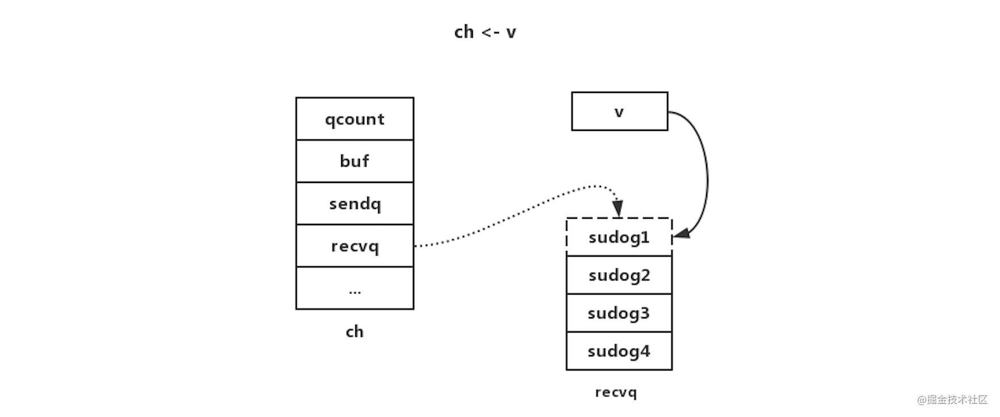

# 深入理解Golang之channel

https://juejin.cn/post/6844904016254599176


### 前言 

Golang在并发编程上有两大利器，分别是`channel`和`goroutine`，这篇文章我们先聊聊`channel`。熟悉Golang的人都知道一句名言：“使用通信来共享内存，而不是通过共享内存来通信”。这句话有两层意思，Go语言确实在`sync`包中提供了传统的锁机制，但更推荐使用`channel`来解决并发问题。这篇文章会先从`channel`的用法、`channel`的原理两部分对`channel`做一个较为深入的探究。

### channel用法 

##### 什么是channel

从字面上看，`channel`的意思大概就是管道的意思。`channel`是一种go协程用以接收或发送消息的安全的消息队列，`channel`就像两个go协程之间的导管，来实现各种资源的同步。可以用下图示意：


`channel`的用法很简单：

```
func main() {
    ch := make(chan int, 1) // 创建一个类型为int，缓冲区大小为1的channel
    ch <- 2 // 将2发送到ch
    n, ok := <- ch // n接收从ch发出的值
    if ok {
        fmt.Println(n) // 2
    }
    close(ch) // 关闭channel
}
复制代码
```

使用`channel`时有几个注意点：

- 向一个`nil` `channel`发送消息，会一直阻塞；
- 向一个已经关闭的`channel`发送消息，会引发运行时恐慌`（panic）`；
- `channel`关闭后不可以继续向`channel`发送消息，但可以继续从`channel`接收消息；
- 当`channel`关闭并且缓冲区为空时，继续从从`channel`接收消息会得到一个对应类型的零值。

#### Unbuffered channels与Buffered channels

`Unbuffered channels`是指缓冲区大小为0的`channel`，这种`channel`的接收者会阻塞直至接收到消息，发送者会阻塞直至接收者接收到消息，这种机制可以用于两个`goroutine`进行状态同步；`Buffered channels`拥有缓冲区，当缓冲区已满时，发送者会阻塞；当缓冲区为空时，接收者会阻塞。

引用[The Nature Of Channels In Go](https://link.juejin.cn?target=https%3A%2F%2Fwww.goinggo.net%2F2014%2F02%2Fthe-nature-of-channels-in-go.html)中的两张图来说明`Unbuffered channels`与`Buffered channels`， 非常形象，读者可自行体会一下：

`Unbuffered channels`：


`Buffered channels`：


#### channel的遍历

##### for range

`channel`支持 `for range` 的方式进行遍历：

```go
package main  

import "fmt"  

func main() {  
    ci := make(chan int, 5)  
    for i := 1; i <= 5; i++ {
        ci <- i
    }    
    close(ci)  

    for i := range ci {  
        fmt.Println(i)  
    }  
}
```

值得注意的是，在遍历时，如果`channel` 没有关闭，那么会一直等待下去，出现 `deadlock` 的错误；如果在遍历时`channel`已经关闭，那么在遍历完数据后自动退出遍历。也就是说，`for range` 的遍历方式时阻塞型的遍历方式。

##### for select

`select`可以处理非阻塞式消息发送、接收及多路选择。

```go
package main  

import "fmt"  

func main() {  
    ci := make(chan int, 2)
    for i := 1; i <= 2; i++ {
        ci <- i
    }
    close(ci)

    cs := make(chan string, 2)
    cs <- "hi"
    cs <- "golang"
    close(cs)

    ciClosed, csClosed := false, false
    for {
        if ciClosed && csClosed {
            return
        }
        select {
        case i, ok := <-ci:
            if ok {
                fmt.Println(i)
            } else {
                ciClosed = true
                fmt.Println("ci closed")
            }
        case s, ok := <-cs:
            if ok {
                fmt.Println(s)
            } else {
                csClosed = true
                fmt.Println("cs closed")
            }
        default:
            fmt.Println("waiting...")
        }
    }
}
```

`select`中有`case`代码块，用于`channel`发送或接收消息，任意一个`case`代码块准备好时，执行其对应内容；多个`case`代码块准备好时，随机选择一个`case`代码块并执行；所有`case`代码块都没有准备好，则等待；还可以有一个`default`代码块，所有`case`代码块都没有准备好时执行`default`代码块。

### channel原理 

先贴一下`channel`的[源码地址](https://link.juejin.cn?target=https%3A%2F%2Fgithub.com%2Fgolang%2Fgo%2Fblob%2Fmaster%2Fsrc%2Fruntime%2Fchan.go)，读者可以对照来看。

#### 数据结构

先看`channel`的结构体：

```go
type hchan struct {
    qcount   uint           // total data in the queue
    dataqsiz uint           // size of the circular queue
    buf      unsafe.Pointer // points to an array of dataqsiz elements
    // channel中元素大小
    elemsize uint16 
    // 是否已关闭
    closed   uint32
    // channel中元素类型
    elemtype *_type // element type
    sendx    uint   // send index
    recvx    uint   // receive index
    recvq    waitq  // list of recv waiters
    sendq    waitq  // list of send waiters

    // lock protects all fields in hchan, as well as several
    // fields in sudogs blocked on this channel.
    //
    // Do not change another G's status while holding this lock
    // (in particular, do not ready a G), as this can deadlock
    // with stack shrinking.
    lock mutex
}
```

`channel`的缓冲区其实是一个环形队列，`qcount`表示队列中元素的数量，`dataqsiz`表示环形队列的总大小，`buf`表示一个指向循环数组的指针；`sendx`和`recvx`分别用来标识当前发送和接收的元素在循环队列中的位置；`recvq`和`sendq`都是一个列表，分别用于存储当前处于等待接收和等待发送的`Goroutine`。

再看一下`waitq`的数据结构：

```go
type waitq struct {
    first *sudog
    last  *sudog
}

type sudog struct {
    // 当前goroutine
    g *g

    // isSelect indicates g is participating in a select, so
    // g.selectDone must be CAS'd to win the wake-up race.
    isSelect bool
    next     *sudog
    prev     *sudog
    elem     unsafe.Pointer // data element (may point to stack)

    // The following fields are never accessed concurrently.
    // For channels, waitlink is only accessed by g.
    // For semaphores, all fields (including the ones above)
    // are only accessed when holding a semaRoot lock.

    acquiretime int64
    releasetime int64
    ticket      uint32
    parent      *sudog // semaRoot binary tree
    waitlink    *sudog // g.waiting list or semaRoot
    waittail    *sudog // semaRoot
    c           *hchan // channel
}
```

其中`sudog`表示处于等待列表中的`Goroutine`封装，包含了一些上下文信息，`first`和`last`分别指向等待列表的首位的`Goroutine`。

#### 编译分析

在分析`channel`的原理之前，我们先使用`go tool`分析以下代码，看看`channel`的各种操作在底层调用了什么运行时方法：

```go
ch := make(chan int, 2)
ch <- 2
ch <- 1
<-ch
n, ok := <-ch
if ok {
    fmt.Println(n)
}
close(ch)
```

编译

```shell
go build test.go
go tool objdump -s "main\.main" test | grep CALL
```

把`CALL`过滤出来：

```
  test.go:118           0x1092f55               e81612f7ff              CALL runtime.makechan(SB)
  test.go:119           0x1092f74               e82714f7ff              CALL runtime.chansend1(SB)
  test.go:120           0x1092f8e               e80d14f7ff              CALL runtime.chansend1(SB)
  test.go:121           0x1092fa5               e8361ff7ff              CALL runtime.chanrecv1(SB)
  test.go:122           0x1092fbd               e85e1ff7ff              CALL runtime.chanrecv2(SB)
  test.go:126           0x1092fd7               e8841cf7ff              CALL runtime.closechan(SB)
  test.go:124           0x1092fea               e8b156f7ff              CALL runtime.convT64(SB)
  print.go:275          0x1093041               e88a98ffff              CALL fmt.Fprintln(SB)
  test.go:47            0x1093055               e896c1fbff              CALL runtime.morestack_noctxt(SB)
```

#### 创建

从上面的编译分析可以看出在创建`channel`时调用了运行时方法`makechan`:

```go
func makechan(t *chantype, size int) *hchan {
    elem := t.elem

    // compiler checks this but be safe.
    if elem.size >= 1<<16 {
        throw("makechan: invalid channel element type")
    }
    if hchanSize%maxAlign != 0 || elem.align > maxAlign {
        throw("makechan: bad alignment")
    }

    // 计算缓冲区需要的总大小（缓冲区大小*元素大小），并判断是否超出最大可分配范围
    mem, overflow := math.MulUintptr(elem.size, uintptr(size))
    if overflow || mem > maxAlloc-hchanSize || size < 0 {
        panic(plainError("makechan: size out of range"))
    }

    // Hchan does not contain pointers interesting for GC when elements stored in buf do not contain pointers.
    // buf points into the same allocation, elemtype is persistent.
    // SudoG's are referenced from their owning thread so they can't be collected.
    // TODO(dvyukov,rlh): Rethink when collector can move allocated objects.
    var c *hchan
    switch {
    case mem == 0:
        // 缓冲区大小为0，或者channel中元素大小为0（struct{}{}）时，只需分配channel必需的空间即可
        // Queue or element size is zero.
        c = (*hchan)(mallocgc(hchanSize, nil, true))
        // Race detector uses this location for synchronization.
        c.buf = c.raceaddr()
    case elem.kind&kindNoPointers != 0:
        // 通过位运算知道channel中元素类型不是指针，分配一片连续内存空间，所需空间等于 缓冲区数组空间 + hchan必需的空间。
        // Elements do not contain pointers.
        // Allocate hchan and buf in one call.
        c = (*hchan)(mallocgc(hchanSize+mem, nil, true))
        c.buf = add(unsafe.Pointer(c), hchanSize)
    default:
        // 元素中包含指针，为hchan和缓冲区分别分配空间
        // Elements contain pointers.
        c = new(hchan)
        c.buf = mallocgc(mem, elem, true)
    }

    c.elemsize = uint16(elem.size)
    c.elemtype = elem
    c.dataqsiz = uint(size)

    if debugChan {
        print("makechan: chan=", c, "; elemsize=", elem.size, "; elemalg=", elem.alg, "; dataqsiz=", size, "\n")
    }
    return c
}
```

`makechan`的代码逻辑还是比较简单的，首先校验元素类型和缓冲区空间大小，然后创建`hchan`，分配所需空间。这里有三种情况：当缓冲区大小为0，或者`channel`中元素大小为0时，只需分配`channel`必需的空间即可；当`channel`元素类型不是指针时，则只需要为`hchan`和缓冲区分配一片连续内存空间，空间大小为缓冲区数组空间加上`hchan`必需的空间；默认情况，缓冲区包含指针，则需要为`hchan`和缓冲区分别分配内存。最后更新`hchan`的其他字段，包括`elemsize`，`elemtype`，`dataqsiz`。

#### 发送

`channel`的发送操作调用了运行时方法`chansend1`, 在
`chansend1`内部又调用了`chansend`，直接来看`chansend`的实现：

```go
func chansend(c *hchan, ep unsafe.Pointer, block bool, callerpc uintptr) bool {
    // channel为nil
    if c == nil {
        // 如果是非阻塞，直接返回发送不成功
        if !block {
            return false
        }
        // 否则，当前Goroutine阻塞挂起
        gopark(nil, nil, waitReasonChanSendNilChan, traceEvGoStop, 2)
        throw("unreachable")
    }

    if debugChan {
        print("chansend: chan=", c, "\n")
    }

    if raceenabled {
        racereadpc(c.raceaddr(), callerpc, funcPC(chansend))
    }

    // Fast path: check for failed non-blocking operation without acquiring the lock.

    // 对于非阻塞且channel未关闭，如果无缓冲区且没有等待接收的Goroutine，或者有缓冲区且缓冲区已满，那么都直接返回发送不成功
    if !block && c.closed == 0 && ((c.dataqsiz == 0 && c.recvq.first == nil) ||
        (c.dataqsiz > 0 && c.qcount == c.dataqsiz)) {
        return false
    }

    var t0 int64
    if blockprofilerate > 0 {
        t0 = cputicks()
    }

    // 加锁
    lock(&c.lock)

    // 如果channel已关闭
    if c.closed != 0 {
        // 解锁，直接panic
        unlock(&c.lock)
        panic(plainError("send on closed channel"))
    }

    // 除了以上情况，当channel未关闭时，就有以下几种情况：

    // 1、当存在等待接收的Goroutine
    if sg := c.recvq.dequeue(); sg != nil {
        // Found a waiting receiver. We pass the value we want to send
        // directly to the receiver, bypassing the channel buffer (if any).

        // 那么直接把正在发送的值发送给等待接收的Goroutine
        send(c, sg, ep, func() { unlock(&c.lock) }, 3)
        return true
    }

    // 2、当缓冲区未满时
    if c.qcount < c.dataqsiz {
        // Space is available in the channel buffer. Enqueue the element to send.
        // 获取指向缓冲区数组中位于sendx位置的元素的指针
        qp := chanbuf(c, c.sendx)
        if raceenabled {
            raceacquire(qp)
            racerelease(qp)
        }
        // 将当前发送的值拷贝到缓冲区
        typedmemmove(c.elemtype, qp, ep)
        // sendx索引加一
        c.sendx++
        // 因为是循环队列，sendx等于队列长度时置为0
        if c.sendx == c.dataqsiz {
            c.sendx = 0
        }
        // 队列中元素总数加一，并解锁，返回发送成功
        c.qcount++
        unlock(&c.lock)
        return true
    }

    // 3、当既没有等待接收的Goroutine，缓冲区也没有剩余空间，如果是非阻塞的发送，那么直接解锁，返回发送失败
    if !block {
        unlock(&c.lock)
        return false
    }

    // Block on the channel. Some receiver will complete our operation for us.
    // 4、如果是阻塞发送，那么就将当前的Goroutine打包成一个sudog结构体，并加入到channel的发送队列sendq里
    gp := getg()
    mysg := acquireSudog()
    mysg.releasetime = 0
    if t0 != 0 {
        mysg.releasetime = -1
    }
    // No stack splits between assigning elem and enqueuing mysg
    // on gp.waiting where copystack can find it.
    mysg.elem = ep
    mysg.waitlink = nil
    mysg.g = gp
    mysg.isSelect = false
    mysg.c = c
    gp.waiting = mysg
    gp.param = nil
    c.sendq.enqueue(mysg)

    // 调用goparkunlock将当前Goroutine设置为等待状态并解锁，进入休眠等待被唤醒
    goparkunlock(&c.lock, waitReasonChanSend, traceEvGoBlockSend, 3)
    // Ensure the value being sent is kept alive until the
    // receiver copies it out. The sudog has a pointer to the
    // stack object, but sudogs aren't considered as roots of the
    // stack tracer.
    KeepAlive(ep)

    // someone woke us up.
    // 被唤醒之后执行清理工作并释放sudog结构体
    if mysg != gp.waiting {
        throw("G waiting list is corrupted")
    }
    gp.waiting = nil
    if gp.param == nil {
        if c.closed == 0 {
            throw("chansend: spurious wakeup")
        }
        panic(plainError("send on closed channel"))
    }
    gp.param = nil
    if mysg.releasetime > 0 {
        blockevent(mysg.releasetime-t0, 2)
    }
    mysg.c = nil
    releaseSudog(mysg)
    return true
}
```

`chansend`的执行逻辑，上面的注释已经写得很清楚了，我们再来梳理一下。对于非阻塞发送或者`channel`已经关闭条件下的几种发送失败的情况，处理逻辑比较简单，读者可以对照注释来看；这里我们重点关注`channel`未关闭时几种常规情况：

##### 存在等待接收的Goroutine

如果等待接收的队列`recvq`中存在`Goroutine`，那么直接把正在发送的值发送给等待接收的`Goroutine`。示意图如下：




具体看一下`send`方法：


```go
func send(c *hchan, sg *sudog, ep unsafe.Pointer, unlockf func(), skip int) {
    ...

    if sg.elem != nil {
        // 将发送的值直接拷贝到接收值（比如v = <-ch 中的v）的内存地址
        sendDirect(c.elemtype, sg, ep)
        sg.elem = nil
    }
    // 获取等待接收数据的Goroutine
    gp := sg.g
    unlockf()
    gp.param = unsafe.Pointer(sg)
    if sg.releasetime != 0 {
        sg.releasetime = cputicks()
    }
    // 唤醒之前等待接收数据的Goroutine
    goready(gp, skip+1)
}
```

这里有必要说明一下`Goroutine`在调度过程中的几种状态：

```go
_Gidle = iota // goroutine刚刚分配，还没有初始化

_Grunnable // goroutine处于运行队列中, 还没有运行，没有自己的栈

_Grunning // goroutine在运行中，拥有自己的栈，被分配了M(线程)和P(调度上下文)

_Gsyscall // goroutine在执行系统调用

_Gwaiting // goroutine被阻塞

_Gdead // goroutine没有被使用，可能是刚刚退出，或者正在初始化中

_Gcopystack // 表示g当前的栈正在被移除并分配新栈
```

当调用`goready`时，将`Goroutine`的状态从 `_Gwaiting`置为`_Grunnable`，等待下一次调度再次执行。

##### 当缓冲区未满时

当缓冲区未满时，找到`sendx`所指向的缓冲区数组的位置，将正在发送的值拷贝到该位置，并增加`sendx`索引以及释放锁，示意图如下：


##### 阻塞发送

如果是阻塞发送，那么就将当前的`Goroutine`打包成一个`sudog`结构体，并加入到`channel`的发送队列`sendq`里。示意图如下：


之后则调用`goparkunlock`将当前`Goroutine`设置为`_Gwaiting`状态并解锁，进入阻塞状态等待被唤醒（调用`goready`）；如果被调度器唤醒，执行清理工作并最终释放对应的`sudog`结构体。

#### 接收

`channel`的接收有两种形式：

```go
<-ch
n, ok := <-ch
```

这两种方式分别调用运行时方法`chanrecv1`和`chanrecv2`:

```go
func chanrecv1(c *hchan, elem unsafe.Pointer) {
    chanrecv(c, elem, true)
}

func chanrecv2(c *hchan, elem unsafe.Pointer) (received bool) {
    _, received = chanrecv(c, elem, true)
    return
}
```

这两个方法最终都会调用`chanrecv`方法：

```go
func chanrecv(c *hchan, ep unsafe.Pointer, block bool) (selected, received bool) {

    if debugChan {
        print("chanrecv: chan=", c, "\n")
    }

    // channel为nil
    if c == nil {
        // 非阻塞直接返回（false, false）
        if !block {
            return
        }
        // 阻塞接收，则当前Goroutine阻塞挂起
        gopark(nil, nil, waitReasonChanReceiveNilChan, traceEvGoStop, 2)
        throw("unreachable")
    }

    // Fast path: check for failed non-blocking operation without acquiring the lock.

    // 非阻塞模式，对于以下两种情况：
    // 1、无缓冲区且等待发送队列也为空
    // 2、有缓冲区但缓冲区数组为空且channel未关闭
    // 这两种情况都是接收失败, 直接返回（false, false）
    if !block && (c.dataqsiz == 0 && c.sendq.first == nil ||
        c.dataqsiz > 0 && atomic.Loaduint(&c.qcount) == 0) &&
        atomic.Load(&c.closed) == 0 {
        return
    }

    var t0 int64
    if blockprofilerate > 0 {
        t0 = cputicks()
    }

    // 加锁
    lock(&c.lock)
    // 如果channel已关闭，并且缓冲区无元素
    if c.closed != 0 && c.qcount == 0 {
        if raceenabled {
            raceacquire(c.raceaddr())
        }
        unlock(&c.lock)
        // 有等待接收的变量（即 v = <-ch中的v）
        if ep != nil {
            //根据channel元素的类型清理ep对应地址的内存，即ep接收了channel元素类型的零值
            typedmemclr(c.elemtype, ep)
        }
        // 返回（true, false），即接收到值，但不是从channel中接收的有效值
        return true, false
    }

    // 除了以上非常规情况，还有有以下几种常见情况：

    // 1、等待发送的队列sendq里存在Goroutine，那么有两种情况：当前channel无缓冲区，或者当前channel已满
    if sg := c.sendq.dequeue(); sg != nil {
        // Found a waiting sender. If buffer is size 0, receive value
        // directly from sender. Otherwise, receive from head of queue
        // and add sender's value to the tail of the queue (both map to
        // the same buffer slot because the queue is full).
        // 如果无缓冲区，那么直接从sender接收数据；否则，从buf队列的头部接收数据，并把sender的数据加到buf队列的尾部
        recv(c, sg, ep, func() { unlock(&c.lock) }, 3)
        // 接收成功
        return true, true
    }

    // 2、缓冲区buf中有元素
    if c.qcount > 0 {
        // Receive directly from queue
        // 从recvx指向的位置获取元素
        qp := chanbuf(c, c.recvx)
        if raceenabled {
            raceacquire(qp)
            racerelease(qp)
        }
        if ep != nil {
            // 将从buf中取出的元素拷贝到当前协程
            typedmemmove(c.elemtype, ep, qp)
        }
        // 同时将取出的数据所在的内存清空
        typedmemclr(c.elemtype, qp)
        // 接收索引 +1
        c.recvx++
        if c.recvx == c.dataqsiz {
            c.recvx = 0
        }
        // buf元素总数 -1
        c.qcount--
        // 解锁，返回接收成功
        unlock(&c.lock)
        return true, true
    }

    // 3、非阻塞模式，且没有数据可以接受
    if !block {
        // 解锁，直接返回接收失败
        unlock(&c.lock)
        return false, false
    }

    // no sender available: block on this channel.
    // 4、阻塞模式，获取当前Goroutine，打包一个sudog
    gp := getg()
    mysg := acquireSudog()
    mysg.releasetime = 0
    if t0 != 0 {
        mysg.releasetime = -1
    }
    // No stack splits between assigning elem and enqueuing mysg
    // on gp.waiting where copystack can find it.
    mysg.elem = ep
    mysg.waitlink = nil
    gp.waiting = mysg
    mysg.g = gp
    mysg.isSelect = false
    mysg.c = c
    gp.param = nil
    // 加入到channel的等待接收队列recvq中
    c.recvq.enqueue(mysg)
    // 挂起当前Goroutine，设置为_Gwaiting状态并解锁，进入休眠等待被唤醒
    goparkunlock(&c.lock, waitReasonChanReceive, traceEvGoBlockRecv, 3)

    // someone woke us up
    // 被唤醒之后执行清理工作并释放sudog结构体
    if mysg != gp.waiting {
        throw("G waiting list is corrupted")
    }
    gp.waiting = nil
    if mysg.releasetime > 0 {
        blockevent(mysg.releasetime-t0, 2)
    }
    closed := gp.param == nil
    gp.param = nil
    mysg.c = nil
    releaseSudog(mysg)
    return true, !closed
}
```

`chanrecv`方法的处理逻辑与`chansend`非常类似，我们这里仍然只分析几种常见情况，其他情况上述注释也解释得比较清楚了，读者可对照相应代码和注释查看。

##### 存在等待发送的Goroutine

如果等待发送的队列`sendq`里存在挂起的`Goroutine`，那么有两种情况：当前`channel`无缓冲区，或者当前`channel`已满。从`sendq`中取出最先阻塞的`Goroutine`，然后调用`recv`方法：

```go
func recv(c *hchan, sg *sudog, ep unsafe.Pointer, unlockf func(), skip int) {
    if c.dataqsiz == 0 {
        // 无缓冲区
        if raceenabled {
            racesync(c, sg)
        }
        if ep != nil {
            // copy data from sender
            recvDirect(c.elemtype, sg, ep)
        }
    } else {
        // 缓冲区已满
        // Queue is full. Take the item at the
        // head of the queue. Make the sender enqueue
        // its item at the tail of the queue. Since the
        // queue is full, those are both the same slot.
        qp := chanbuf(c, c.recvx)
        if raceenabled {
            raceacquire(qp)
            racerelease(qp)
            raceacquireg(sg.g, qp)
            racereleaseg(sg.g, qp)
        }
        // copy data from queue to receiver
        if ep != nil {
            typedmemmove(c.elemtype, ep, qp)
        }
        // copy data from sender to queue
        typedmemmove(c.elemtype, qp, sg.elem)
        c.recvx++
        if c.recvx == c.dataqsiz {
            c.recvx = 0
        }
        c.sendx = c.recvx // c.sendx = (c.sendx+1) % c.dataqsiz
    }
    sg.elem = nil
    gp := sg.g
    unlockf()
    gp.param = unsafe.Pointer(sg)
    if sg.releasetime != 0 {
        sg.releasetime = cputicks()
    }
    // 将等待发送数据的Goroutine的状态从_Gwaiting置为 _Grunnable，等待下一次调度。
    goready(gp, skip+1)
}
```

1、如果无缓冲区，那么直接从`sender`接收数据；
2、如果缓冲区已满，从`buf`队列的头部接收数据，并把`sender`的数据加到buf队列的尾部；
3、最后调用`goready`函数将等待发送数据的`Goroutine`的状态从`_Gwaiting`置为`_Grunnable`，等待下一次调度。

下图示意了当缓冲区已满时的处理过程：


##### 缓冲区buf中还有数据

如果缓冲区`buf`中还有元素，那么就走正常的接收，将从`buf`中取出的元素拷贝到当前协程的接收数据目标内存地址中。值得注意的是，即使此时`channel`已经关闭，仍然可以正常地从缓冲区`buf`中接收数据。这种情况比较简单，示意图就不画了。

##### 阻塞接收

如果是阻塞模式，且当前没有数据可以接收，那么就需要将当前`Goroutine`打包成一个`sudog`加入到`channel`的等待接收队列`recvq`中，将当前`Goroutine`的状态置为`_Gwaiting`，等待唤醒。示意图如下：


如果之后当前`Goroutine`被调度器唤醒，则执行清理工作并最终释放对应的`sudog`结构体。

#### 关闭

说完收发数据，最后就是关闭`channel`了：

```go
func closechan(c *hchan) {
    // nil channel检查
    if c == nil {
        panic(plainError("close of nil channel"))
    }

    lock(&c.lock)
    // 已关闭的channel不能再次关闭
    if c.closed != 0 {
        unlock(&c.lock)
        panic(plainError("close of closed channel"))
    }

    if raceenabled {
        callerpc := getcallerpc()
        racewritepc(c.raceaddr(), callerpc, funcPC(closechan))
        racerelease(c.raceaddr())
    }
    // 设置关闭状态为1
    c.closed = 1

    var glist glist

    // release all readers
    // 遍历recvq，清除sudog的数据，取出其中处于_Gwaiting状态的Goroutine加入到glist中
    for {
        sg := c.recvq.dequeue()
        if sg == nil {
            break
        }
        if sg.elem != nil {
            typedmemclr(c.elemtype, sg.elem)
            sg.elem = nil
        }
        if sg.releasetime != 0 {
            sg.releasetime = cputicks()
        }
        gp := sg.g
        gp.param = nil
        if raceenabled {
            raceacquireg(gp, c.raceaddr())
        }
        glist.push(gp)
    }

    // release all writers (they will panic)
    // 遍历sendq，清除sudog的数据，取出其中处于_Gwaiting状态的Goroutine加入到glist中
    for {
        sg := c.sendq.dequeue()
        if sg == nil {
            break
        }
        sg.elem = nil
        if sg.releasetime != 0 {
            sg.releasetime = cputicks()
        }
        gp := sg.g
        gp.param = nil
        if raceenabled {
            raceacquireg(gp, c.raceaddr())
        }
        glist.push(gp)
    }
    unlock(&c.lock)

    // Ready all Gs now that we've dropped the channel lock.
    将glist中所有Goroutine的状态置为_Grunnable，等待调度器进行调度
    for !glist.empty() {
        gp := glist.pop()
        gp.schedlink = 0
        goready(gp, 3)
    }
}
```

1、关闭`channel`时，会遍历`recvq`和`sendq`（实际只有`recvq`或者`sendq`），取出`sudog`中挂起的`Goroutine`加入到`glist`列表中，并清除`sudog`上的一些信息和状态。

2、然后遍历`glist`列表，为每个`Goroutine`调用`goready`函数，将所有`Goroutine`置为`_Grunnable`状态，等待调度。

3、当`Goroutine`被唤醒之后，会继续执行`chansend`和`chanrecv`函数中当前`Goroutine`被唤醒后的剩余逻辑。

### 总结 

总结一下，本文先通过`channel`的基本用法对`channel`的定义、用法细节进行了介绍，然后对`channel`的基本操作包括发送、接收和关闭进行了较为详细和深入的探究。细心的读者应该也会发现`channel`的操作跟协程的调度关系密切，不过这篇文章关于`goroutine`的调度只是一笔带过，后续时机成熟会对这部分内容再作探究。

### 参考资料 

1、[The Nature Of Channels In Go](https://link.juejin.cn?target=https%3A%2F%2Fwww.goinggo.net%2F2014%2F02%2Fthe-nature-of-channels-in-go.html)
2、[Concurrency in Golang](https://link.juejin.cn?target=http%3A%2F%2Fwww.minaandrawos.com%2F2015%2F12%2F06%2Fconcurrency-in-golang%2F)


